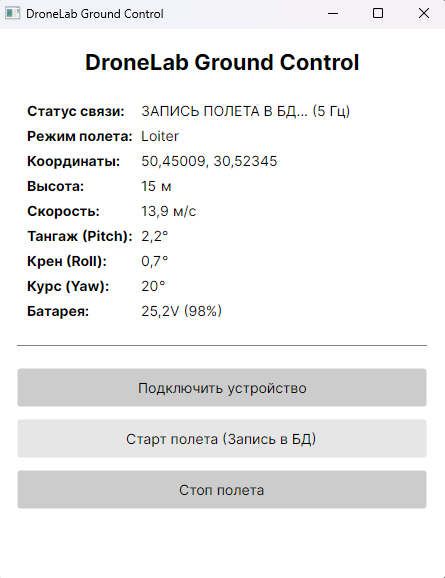

# DroneLab Ground Control

**DroneLab** — это кроссплатформенное приложение наземной станции управления (GCS) для мониторинга телеметрии БПЛА в реальном времени. Проект разработан на платформе **.NET 10** с использованием фреймворка **Avalonia UI** и спроектирован по принципам чистой архитектуры (**Clean Architecture**).

---

## 📱 Интерфейс приложения

<p align="center">
  
</p>

---

## 🚀 Основной функционал

*   **Мониторинг телеметрии в реальном времени:** Отслеживание пространственной ориентации (Pitch, Roll, Yaw), координат (GPS), высоты, скорости и состояния батареи.
*   **Высокоскоростная связь:** Поддержка стабильного соединения по беспроводным каналам передачи данных (включая диапазоны 5 ГГц).
*   **Энергонезависимое логирование:** Автоматическая запись всех параметров и состояний полета в локальную базу данных (SQLite) для последующего анализа миссий.
*   **Управление состояниями:** Интуитивное подключение устройств, запуск и остановка фиксации полетных данных одной кнопкой.

---

## 🏗️ Архитектура проекта

Приложение разделено на независимые слои в соответствии с канонами **Clean Architecture**, что обеспечивает высокую тестируемость и легкую замену компонентов:

*   **DroneLab.Domain:** Ядро системы. Содержит базовые сущности телеметрии, бизнес-правила и типы данных (координаты, углы ориентации, состояние батареи). Не имеет внешних зависимостей.
*   **DroneLab.Application:** Слой бизнес-логики. Описывает сценарии использования (Use Cases), такие как обработка потока телеметрии, управление сессиями полета и интерфейсы (инверсия зависимостей) для работы с БД.
*   **DroneLab.Infrastructure:** Реализация инфраструктурных задач. Отвечает за взаимодействие с базой данных (SQLite/Entity Framework Core) и низкоуровневый прием данных с устройства.
*   **DroneLab.UI (Avalonia UI):** Слой представления. Построен с использованием паттерна **MVVM**. Благодаря Avalonia UI, интерфейс является полностью кроссплатформенным и обладает высокой производительностью отрисовки.

---

## 🛠️ Технологический стек

*   **Платформа:** .NET 10 (C#)
*   **UI Фреймворк:** Avalonia UI (MVVM)
*   **База данных:** SQLite
*   **Архитектурный паттерн:** Clean Architecture

---

## 🏁 Быстрый запуск

Для запуска приложения локально убедитесь, что у вас установлен SDK .NET 10.

1. Склонируйте репозиторий:
   ```bash
   git clone [https://github.com/VR1110/DroneLab.git](https://github.com/VR1110/DroneLab.git)